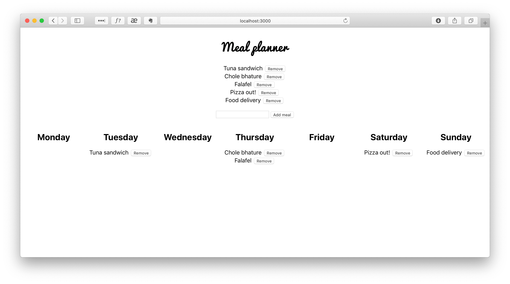
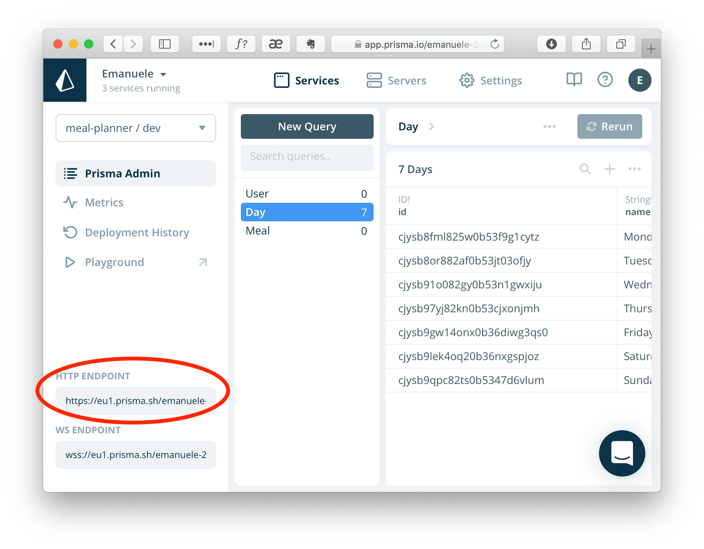

# Meal Planner demo app with React + GraphQL + Prisma Cloud



## Setup Prisma Cloud and Prisma CLI

The project was deployed on [Prisma Cloud.](https://www.prisma.io/cloud). You can setup your instance of [Prisma Cloud for free](https://app.prisma.io). Follow the instructions to create the account and a service. For the purpose of this demo, it doesn't matter what database or location you choose.

[Install the Prisma CLI](https://www.prisma.io/docs/prisma-cli-and-configuration/using-the-prisma-cli-alx4/) on your computer.

Please note that we will be using a environment variable to setup the Prisma secret (see [Using variables in prisma.yml](https://www.prisma.io/docs/prisma-cli-and-configuration/prisma-yml-5cy7/#environment-variable). Add an environment variable called `PRISMA_SECRET`. It can be whatever string you want.

Then open the terminal in `./server/` and run:

```shell script
prisma deploy
```

This will create the service and database on Prisma Cloud and it will populate the days collection using the `seed` option in _prisma.yml_ and the default data in _seed.zip_ (check [here](https://www.prisma.io/docs/reference/service-configuration/prisma.yml/yaml-structure-ufeshusai8#seed-(optional)) for more information).

## Setup the Meal Planner demo

Copy the Prisma endpoint from the service interface and paste it as the `endpoint` value in _server/prisma.yml_. If the pasted value contains a `header` query parameter, you must remove it.



Rename _.env-sample_ to just _.env_ and past the same endpoint value in `REACT_APP_PRISMA_URL`. You can get the `bearer` value simply by running `prisma token` from the `./server` folder. Paste it in `REACT_APP_PRISMA_BEARER`.

Now, from the root folder of the project run:

```shell script
npm install
npm start
```

This should do it. If you have problems setting it up, please open a Github or ping me on Twitter. I am [@EFeliziani](https://twitter.com/EFeliziani).

## Available Scripts

In the project directory, you can run:

### `npm start`

Runs the app in the development mode.<br>
Open [http://localhost:3000](http://localhost:3000) to view it in the browser.

The page will reload if you make edits.<br>
You will also see any lint errors in the console.

### `npm test`

Launches the test runner in the interactive watch mode.<br>
See the section about [running tests](https://facebook.github.io/create-react-app/docs/running-tests) for more information.

### `npm run build`

Builds the app for production to the `build` folder.<br>
It correctly bundles React in production mode and optimizes the build for the best performance.

The build is minified and the filenames include the hashes.<br>
Your app is ready to be deployed!

See the section about [deployment](https://facebook.github.io/create-react-app/docs/deployment) for more information.

### `npm run eject`

**Note: this is a one-way operation. Once you `eject`, you can’t go back!**

If you aren’t satisfied with the build tool and configuration choices, you can `eject` at any time. This command will remove the single build dependency from your project.

Instead, it will copy all the configuration files and the transitive dependencies (Webpack, Babel, ESLint, etc) right into your project so you have full control over them. All of the commands except `eject` will still work, but they will point to the copied scripts so you can tweak them. At this point you’re on your own.

You don’t have to ever use `eject`. The curated feature set is suitable for small and middle deployments, and you shouldn’t feel obligated to use this feature. However we understand that this tool wouldn’t be useful if you couldn’t customize it when you are ready for it.

## Learn More

You can learn more in the [Create React App documentation](https://facebook.github.io/create-react-app/docs/getting-started).

To learn React, check out the [React documentation](https://reactjs.org/).

### Code Splitting

This section has moved here: https://facebook.github.io/create-react-app/docs/code-splitting

### Analyzing the Bundle Size

This section has moved here: https://facebook.github.io/create-react-app/docs/analyzing-the-bundle-size

### Making a Progressive Web App

This section has moved here: https://facebook.github.io/create-react-app/docs/making-a-progressive-web-app

### Advanced Configuration

This section has moved here: https://facebook.github.io/create-react-app/docs/advanced-configuration

### Deployment

This section has moved here: https://facebook.github.io/create-react-app/docs/deployment

### `npm run build` fails to minify

This section has moved here: https://facebook.github.io/create-react-app/docs/troubleshooting#npm-run-build-fails-to-minify
